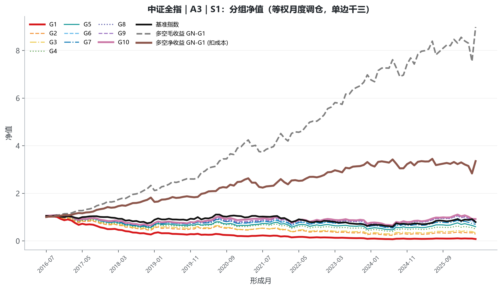

<div align="center">

# 日内量价路径形态因子研究

**从 1 分钟量价序列中提取日频截面信息**  
路径曲折度 · 量价时序关系 · 成交时间集中度


[研究报告](report.pdf) · [数据格式](data/README.md) · [结果总表](result/backtest_v4/master_summary.csv) · [复现指南](#复现指南)

</div>

---

传统日频因子将一天压缩为开、高、低、收和成交量等少数统计量；本项目关注同样的日收益与成交量背后，价格和成交在日内是如何演化的。研究将 1 分钟数据映射为可交易的月度截面因子，并在沪深 300、中证 500、中证 1000 和中证全指上完成统一口径的 IC、分组、多空、风格中性化与衰减检验。

研究区间为 **2016-07 至 2026-06**，共 120 个形成月。正式结果使用修正持仓权重漂移与多空方向后的 **V4 口径**：4 个股票池 × 18 个因子 × 2 种中性化方案，共 **144 组基础回测**。

## 目录

- [研究问题与主要发现](#研究问题与主要发现)
- [项目结构](#项目结构)
- [研究框架](#研究框架)
- [因子体系](#因子体系)
- [回测设计与结果](#回测设计与结果)
- [数据说明](#数据说明)
- [环境与安装](#环境与安装)
- [复现指南](#复现指南)
- [研究边界](#研究边界)

## 研究问题与主要发现

### 研究问题

同样的涨跌幅和成交量，可以来自平滑趋势、反复震荡、尾盘放量、量价错位，或关键价格节点的集中成交。本研究希望回答：这些**路径形态**是否包含独立于常规日频统计量的横截面预测信息？

### 研究贡献

1. **统一算子体系**：将分钟序列的数据变换（向量到向量）与 K 线聚合（向量到标量）组合为可批量计算的因子表达；所有因子最终落在“股票—交易日”粒度。
2. **三类日内信息视角**：分别刻画价格路径微观结构、量价领先滞后关系、成交在时间轴上的集中程度。
3. **条件化构造方法**：通过高/低曲折时段、放量状态与累计收益创新高等条件，定位具有经济含义的局部状态，而非只使用全天总量。
4. **完整可审计流程**：从分钟 HDF5、日度原子、20 日滚动因子、月末面板到中性化、回测和衰减分析均提供源码；历史 V3 结果保留用于口径审计。

### V4 正式结果摘要

在中小盘和全市场股票池中，条件含义明确的路径因子具有较好的区分度。以 A3（高曲折且放量分钟占比）为例：

| 股票池 | 中性化 | RankIC | RankICIR | 有效方向多空年化 | 多空夏普 |
|---|---:|---:|---:|---:|---:|
| 中证全指 | S1 | 9.32% | 3.53 | 12.87% | 1.02 |
| 中证 1000 | S1 | 9.42% | 3.30 | 10.15% | 0.71 |

结果用于说明历史样本内的因子区分能力，不构成未来收益承诺。完整数字以 [`result/backtest_v4/master_summary.csv`](result/backtest_v4/master_summary.csv) 为准。

<p align="center">
  
</p>

<p align="center"><sub>中证全指 · A3 高曲折且放量分钟占比 · S1 中性化 · 等权月度调仓、单边千三成本</sub></p>

## 项目结构

```text
.
├── data/
│   └── README.md                       # 数据来源、字段、HDF5 布局、样例与质量检查
├── src/
│   ├── 02_...09_*.py                   # 从缓存构建到 V4 回测与风格检验
│   ├── 11_factor_decay.py               # 因子时序衰减分析
│   ├── 12_build_report_figures.py       # 报告图表生成
│   ├── factors_a.py                     # A：路径微观结构
│   ├── factors_b.py                     # B：量价时序
│   ├── factors_c.py                     # C：成交时序集中度
│   ├── lib_common.py                    # 参数、路径、因子注册与公共函数
│   ├── lib_fdrive.py                    # HDF5 数据访问层
│   ├── report/                          # 报告 Markdown、TeX 与图形资产
│   ├── requirements.txt                 # Python 依赖
│   ├── run_pipeline.ps1                 # 全流程入口
│   └── build_report.ps1                 # PDF 报告构建入口
├── result/
│   ├── backtest_v4/                     # 正式回测结果（唯一正式口径）
│   ├── decay_v4/                        # 与 V4 一致的衰减分析
│   ├── style_test/                      # 九风格暴露与中性化检验
│   ├── backtest_v3/                     # 历史口径，仅用于审计对照
│   └── decay/                           # 历史衰减结果，仅用于审计对照
├── README.md
└── report.pdf
```

原始分钟行情、日频宽表和中间 Parquet 缓存不随仓库发布：它们受数据授权限制，且分钟库约 819 GB。所需数据的精确格式、字段含义与读取示例见 [`data/README.md`](data/README.md)。

## 研究框架

```text
分钟 HDF5 ──> 日度原子 ──> 20 日滚动因子 ──┐
                                              ├─> 月末面板 ─> 去极值/中性化 ─> IC 与分组回测
日频宽表 ──> 交易日历、收益、状态、行业 ──┘                         │
                                                                    ├─> 九风格检验
                                                                    └─> 时序衰减分析
```

| 环节 | 实现原则 |
|---|---|
| 分钟读取 | 单交易日整块顺序读取，并散布为“股票 × 240 分钟”矩阵 |
| 原子计算 | 用 NumPy 沿分钟轴向量化；无效分钟和无定义值保留 `NaN` |
| 因子形成 | 先生成日度原子，再以 20 个交易日滚动聚合；最少要求 15 个有效日 |
| 断点续跑 | 每 42 个交易日分片落盘，以进度文件记录已完成区间 |
| 截面处理 | 因子独立取有效样本，5 倍 MAD 去极值后施密特正交化 |
| 中性化 | S1：市值+行业；S2：再控制换手率和波动率；S3：九类风格扩展检验 |
| 回测 | 月度调仓；沪深 300/中证 500 分 5 组，其余股票池分 10 组；单边成本 0.3% |

## 因子体系

每个高频因子均由两类算子嵌套而成：

- **数据变换（向量到向量）**：分钟收益、成交占比、滞后差分、条件标记；
- **K 线聚合（向量到标量）**：求和、标准差、熵、相关系数、条件均值和滚动聚合。

### A. 路径微观结构

| 因子 | 含义 | 研究问题 |
|---|---|---|
| A1 / A1v | 路径长度相对净位移、波动调整后的曲折度 | 价格是平滑运动还是反复折返？ |
| A2a–A2d | 高/低曲折区间的收益波动、累计收益、成交占比与换手 | 条件化切分后，局部路径是否携带额外信息？ |
| A3 | 高曲折且放量分钟的占比 | 噪音与成交活跃是否同时集中？ |

### B. 量价时序特征

| 因子 | 含义 | 研究问题 |
|---|---|---|
| B1–B4 | 成交量变化、收益与条件状态之间的多阶领先/滞后关系 | 是量先于价，还是价先于量？ |
| B5a–B5c | 按时间段、价格状态和累计收益新高条件刻画量能 | 趋势是否被成交确认？ |

B5c 是“时间点划分”思想的代表：先识别累计收益创新高等稀疏锚点事件，再比较锚点与非锚点状态的量能。

### C. 成交时序集中度

| 因子 | 含义 | 研究问题 |
|---|---|---|
| C1 | 标准化分钟成交占比熵 | 成交是均匀发生还是集中于少数时段？ |
| C2 | 上涨分钟与下跌分钟的成交集中度差 | 买卖方向的成交时序是否不对称？ |
| C3 | C1 日度原子的 20 日标准差 | 成交时间结构是否稳定？ |

完整公式与定义域见 [`report.pdf`](report.pdf) 附录，以及 [`src/factors_a.py`](src/factors_a.py)、[`src/factors_b.py`](src/factors_b.py)、[`src/factors_c.py`](src/factors_c.py)。

## 回测设计与结果

| 项目 | 设置 |
|---|---|
| 形成期 | 20 个交易日，至少 15 个有效日 |
| 调仓频率 | 月末形成、月度持有 |
| 股票池 | 沪深 300、中证 500、中证 1000、中证全指 |
| 中性化 | S1、S2 为基础口径；S3 为九风格扩展检验 |
| 评估指标 | IC、RankIC、ICIR、分组年化收益、有效方向多空收益、夏普、换手与基准收益 |

正式结果入口如下：

| 文件/目录 | 内容 |
|---|---|
| [`result/backtest_v4/master_summary.csv`](result/backtest_v4/master_summary.csv) | 144 组基础回测汇总 |
| [`result/backtest_v4/`](result/backtest_v4/) | 各股票池、因子与中性化方案的明细、图表与汇总 |
| [`result/style_test/`](result/style_test/) | 九风格相关、暴露回归与 S1/S2/S3 对照 |
| [`result/decay_v4/decay_master.csv`](result/decay_v4/decay_master.csv) | 前后半样本、2025 年以来子样本、趋势与回撤等衰减指标 |

`backtest_v3` 与 `decay` 仅用于审计历史口径，不应与 V4 正式结论混用。字段说明见 [`result/README.md`](result/README.md)。

## 数据说明

项目使用两类输入：

1. **1 分钟行情 HDF5**：用于计算日内原子量，覆盖价格、成交量、成交额及必要状态字段；
2. **日频宽表与交易日历**：用于股票池、行业、市值、换手率、波动率、复权收益和中性化控制变量。

数据需由具有相应授权的使用者自行准备。HDF5 分组布局、股票代码格式、交易日对齐规则、字段样例与质量检查流程详见 [`data/README.md`](data/README.md)。

## 环境与安装

测试环境为 Windows 11、Python 3.12、MiKTeX/XeLaTeX。主要依赖包括 NumPy、pandas、SciPy、Matplotlib、h5py 和 PyArrow；构建九风格暴露时还需要 `cjpy` 及有权限的数据账户。

```powershell
python -m venv .venv
.\.venv\Scripts\Activate.ps1
python -m pip install -r .\src\requirements.txt
```

如需构建 PDF 报告，请安装 XeLaTeX 与中文字体：

```powershell
powershell -ExecutionPolicy Bypass -File .\src\build_report.ps1
```

## 复现指南

### 快速验证因子实现

该步骤只使用合成数据，不需要市场数据：

```powershell
& $env:PYTHON_EXE .\src\91_smoke_atoms.py
```

独立慢循环对照位于 `92_verify_atoms.py`，数据口径勾稽与中性化诊断位于 `93_` 至 `96_` 脚本。

### 配置数据路径

关键路径均可通过环境变量覆盖：

```powershell
$env:HF_MINUTE_DIR = "E:\market_data\minute_1m"
$env:HF_BASE_DIR = "E:\market_data\daily_base"
$env:HF_CALENDAR_FILE = "E:\market_data\trading_calendar.npy"
$env:HF_CACHE_ROOT = "E:\hf_factor_cache"
$env:PYTHON_EXE = ".\.venv\Scripts\python.exe"
```

`08_build_style_exposure.py` 优先使用 `cjpy` 的本地持久化凭证，也可从 `CJ_API_TOKEN` 环境变量读取。仓库不包含 API token、账户口令、`.env` 或原始受限数据。

### 运行完整流水线

```powershell
powershell -ExecutionPolicy Bypass -File .\src\run_pipeline.ps1
```

依次执行：日频缓存、日度原子、滚动因子、月末面板、因子处理、V4 回测、九风格暴露、风格检验、V4 衰减分析和报告图生成。分钟数据阶段涉及大量磁盘读取，脚本支持分片断点续跑。

如需修改研究口径，请优先调整 [`src/lib_common.py`](src/lib_common.py) 中的集中参数，避免在下游脚本中分散修改。

## 研究边界

- 仓库可复现算法、处理逻辑和结果生成过程，但不再分发受授权限制的原始行情；
- S1/S2 主回测仅依赖基础日频控制变量；S3 九风格检验还依赖外部的 point-in-time 财务与风格数据权限；
- 替换数据源时，必须重新核对复权规则、成交量/成交额单位、停牌行处理和分钟对齐规则；
- 历史回测不代表未来表现，本项目仅用于量化研究和方法展示，不构成投资建议。
